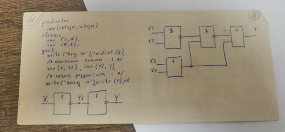
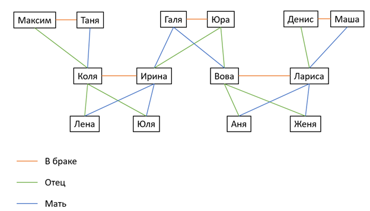

## Лабораторная работа № 1
<strong>Задание:</strong> описать логическую схему, используя язык Prolog. Вывести 4 результата вариантов запросов:
1) Ввести 4 входных значения, получить 1 выходное значение;
2) Ввести выходное значение, получить 1 набор начальных значений;
3) Ввести выходное значение, получить все наборы входных значений для этого значения; 
4) Вывести таблицу истинности.

<strong>Файлы:</strong>  
- task1-1.pro
- task1-2.pro
- task1-3.pro
- task1-4.pro

Схема  
  

  
## Лабораторная работа № 2
<strong>Тема:</strong> родственные отношения  
 
Пример дерева:  
  
 
<strong>Файл:</strong> task2.pro

## Лабораторная работа № 3
<strong>Тема</strong>: работа со списками  
<strong>Задание:</strong> найти максимальный элемент в списке и его позицию  
<strong>Файл:</strong> task3.pro

## Лабораторная работа № 4
<strong>Тема</strong>: работа со списками  
<strong>Задание:</strong> разбить список на два (1 - положительные элементы, 2 - отрицательные)  
<strong>Файл:</strong> task4.pro

## Лабораторная работа № 5
<strong>Тема</strong>: работа со списками  
<strong>Задание:</strong> найти самый длинный палиндром в списке  
<strong>Файл:</strong> task5.pro